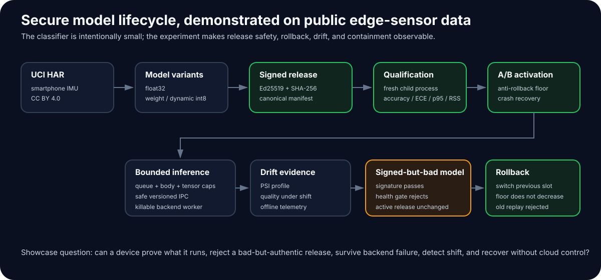
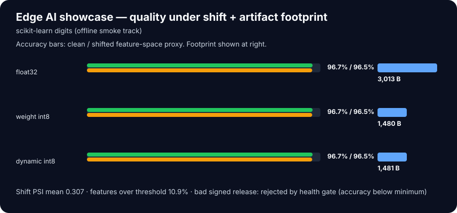

# Edge AI Deployment Platform

**A production-oriented edge AI deployment agent built to survive bad models, crashes, overload, rollback attempts, and offline operation.** Made by Jarkko Ahtiluoma and uploaded to Github 21.8.2026.

The project is intentionally not about maximizing benchmark accuracy. It demonstrates the harder part of edge ML: **proving what is running, deciding whether a signed release is safe to activate, containing faulty runtimes, detecting data shift, and recovering deterministically without depending on cloud control.**



## What this project proves

| Failure / operational question | Implemented control |
|---|---|
| Was the model modified or signed by an untrusted/revoked key? | Ed25519 signatures, SHA-256 integrity, strict canonical manifests, keyring revocation |
| Can an old release be replayed? | Monotonic release sequence, application rollback floor, optional external-anchor transaction |
| Can a validly signed but bad model replace the active release? | Accuracy / calibration / latency / RSS health gate before A/B promotion |
| Can a model path be swapped after verification? | Stable no-follow file handles and re-authentication across lifecycle boundaries |
| Can malformed/compressed model data allocate unexpectedly? | Bounded NPZ preflight before allocation |
| Can traffic overload the inference path? | Pre-body request cap, bounded queue, queue deadlines, input/output tensor limits |
| Can native inference hang or crash the service? | Optional killable process workers, hard execution deadlines, safe non-pickle IPC, global restart circuit breaker |
| What happens while telemetry is offline? | Durable bounded spool with retry-stable event IDs |
| Can input shift be observed locally? | PSI reference profiles and generated drift evidence |
| Can a failed activation be recovered? | Crash-consistent A/B state, authenticated recovery, rollback semantics |

## Showcase: real public edge-sensor data

The primary GitHub experiment uses **UCI Human Activity Recognition Using Smartphones**: smartphone accelerometer/gyroscope data from 30 volunteers performing six activities. UCI distributes the dataset under **CC BY 4.0**. The public table contains 10,299 windows and 561 engineered time/frequency-domain features.

The experiment deliberately asks a systems question:

> **Can the device preserve release safety when model quality, input distribution, or the runtime itself becomes unreliable?**

### Reproduce it

```bash
python -m pip install -e '.[dev]'
edgeai dataset fetch uci-har --destination data/uci-har
edgeai showcase --dataset uci-har --data-dir data/uci-har --output-dir results/showcase/uci-har
```

Or:

```bash
make showcase-real
```

Each run generates:

```text
results/showcase/uci-har/
  showcase.json          # machine-readable evidence
  showcase-summary.svg   # GitHub-renderable result graphic
  README.md              # experiment report
```

See [dataset provenance and licensing](DATASETS.md) and [experiment methodology](docs/showcase/EXPERIMENTS.md).

## What the showcase experiment demonstrates

### 1. Quantization is a measured trade-off

The same trained release is evaluated as float32, per-output-channel weight int8, and dynamic int8. The report records held-out accuracy, calibration, artifact size, host-reference p95 latency, peak RSS, and shifted-input accuracy.

The project does **not** claim that int8 is automatically faster. If a reference implementation gets smaller but slower, the negative latency result remains visible.

### 2. Distribution shift is visible before it becomes a mystery outage

A PSI profile is fitted on training features. The experiment compares the clean held-out set with a deterministic bounded feature-space shift proxy and records both drift magnitude and accuracy response.

The proxy is deliberately described as a **feature-space demonstration**, not as a physical sensor simulator.

### 3. A valid signature does not make a model operationally safe

The experiment creates three signed releases:

```text
1.0.0  float baseline         → accepted
1.1.0  weight-int8 candidate  → accepted if healthy
1.2.0  intentionally degraded → signature valid, health gate rejects
```

After the bad candidate is rejected, the active release remains unchanged. An operator rollback can select the previous slot, but the trusted anti-rollback floor does not decrease, so ordinary replay of an older release is still rejected.

That separation between **authenticity** and **fitness for activation** is one of the main engineering values of the project.

### 4. The experiment outputs evidence, not screenshots

Results are generated from one JSON source of truth into a Markdown report and SVG summary. The public-data workflow can be rerun from GitHub Actions without committing the raw dataset.

## Offline smoke demo

No network is required to exercise the same lifecycle mechanics:

```bash
edgeai showcase --dataset digits --output-dir results/showcase/digits
```

Current committed smoke-run visualization:



This track is for CI/development. **The UCI HAR experiment is the headline showcase workload.**

## Architecture

```text
public / imported model data
          │
          ▼
 training + quantization
          │
          ▼
 canonical signed manifest ──► immutable registry
                                      │
                            verify exact artifact
                                      │
                                      ▼
                          isolated candidate qualification
                        accuracy / ECE / latency / RSS
                              │                 │
                           reject             promote
                                                │
                                                ▼
                                       crash-consistent A/B
                                                │
                                                ▼
                                   bounded HTTP admission
                                                │
                                      safe versioned IPC
                                                │
                                                ▼
                                      killable backend worker
                                                │
                     ┌──────────────────────────┴──────────────┐
                     ▼                                         ▼
              offline telemetry                         PSI drift evidence
```

The reference control plane is Python. C++20 is used for performance-sensitive native primitives and is qualified separately in Release and ASan/UBSan builds. Keeping the language set small reduces the trusted and reproducibility surface.

## Security and lifecycle highlights

Release artifacts use Ed25519 signatures. The runtime contains trusted public keys only; private signing material is outside the deployment package. Manifests include semantic version, monotonically increasing release sequence, model kind, runtime ABI, exact model SHA-256/size, validation metrics, creation time, and metadata.

A/B deployment re-authenticates artifacts across staging and rename boundaries. Deployment state is committed atomically and recovery authenticates crash residue before deciding whether to complete or restore a transition. When an external monotonic `RollbackAnchor` is configured, a durable journal bridges the failure window between advancing protected state and committing local state.

Process-isolated inference uses a versioned bounded raw-byte protocol rather than Python pickle. Child workers are stripped of inherited environment variables before backend loading, run with core dumps disabled, can receive file-descriptor/resource limits, and are subject to an executor-wide restart budget. These controls improve fault/security containment but are **not represented as a complete OS sandbox**.

See:

- [Threat model](docs/security/THREAT_MODEL.md)
- [Current adversarial review](docs/verification/ADVERSARIAL_REVIEW.md)
- [Production-readiness boundary](docs/verification/PRODUCTION_READINESS.md)
- [Architecture](docs/architecture/ARCHITECTURE.md)
- [ADRs](docs/adr/)

## Model/runtime support

Qualified reference runtimes include:

- `float32-linear`
- `int8-weight-linear`
- `int8-dynamic-linear`

A narrow `onnxruntime-cpu` adapter is also implemented with an intentionally constrained single-input/single-output float32 rank-2 contract and explicit CPU provider/thread controls. **The adapter contract is tested, but real native ONNX Runtime execution is not claimed as qualified unless the optional runtime is installed and exercised in the qualification environment.**

## Service boundary

FastAPI exposes:

```text
GET  /healthz
GET  /readyz
GET  /metrics
POST /v1/predict
```

Production construction requires authentication and disables interactive API docs by default. Prediction admission is bounded before expensive parsing/model execution. Queue saturation and execution deadlines are reported separately.

## Development and qualification

```bash
make test
make coverage
make cpp
make cpp-sanitize
make evaluate
make research
```

Run all local qualification gates:

```bash
make qualify
```

Run showcase paths:

```bash
make showcase       # fully offline smoke evidence
make showcase-real  # acquire UCI HAR + public-data experiment
```

GitHub Actions covers multiple Python versions, wheel/install smoke tests, reproducible wheel bytes, dependency-lock/SBOM checks, native Release + ASan/UBSan testing, container build smoke tests, and CodeQL. The real-data showcase is a separate manual workflow so routine pull requests do not depend on a 58 MB public dataset download.

## Repository map

```text
src/edgeai/
  artifact.py        signing, hashes, strict manifests, keyring
  registry.py        immutable signed-release registry
  deploy.py          A/B deployment, health gates, crash recovery, anti-rollback
  rollback_anchor.py external monotonic-anchor contract + software test doubles
  model_io.py        stable-handle NPZ preflight and allocation bounds
  runtime.py         bounded executor + killable process supervision
  ipc.py             versioned bounded non-pickle process protocol
  sandbox.py         disposable backend-process hardening
  service.py         authenticated/bounded FastAPI boundary
  telemetry.py       durable offline spool with stable event IDs
  drift.py           PSI drift monitoring
  datasets.py        safe public-data acquisition + provenance
  showcase.py        reproducible GitHub-facing experiment

cpp/                  checked native int8 primitives
configs/              production-oriented reference settings
docs/                 architecture, threat model, ADRs, verification
results/               generated evaluation/research/showcase evidence
artifacts/             SBOM and qualification artifacts
```

## Explicit limits

This repository does **not** claim:

- resistance to hostile root or rollback of the complete filesystem without a real protected monotonic anchor;
- mTLS/device-identity provisioning;
- kernel/reverse-proxy protection against connection floods or slow clients;
- a complete namespace/seccomp/cgroup backend sandbox;
- target-device thermal, power, accelerator, or WCET qualification;
- real ONNX Runtime/TensorRT qualification unless those backends are actually exercised on the declared target.

Those boundaries are documented intentionally so the showcase remains credible rather than maximalist.

## License

Project source code is MIT licensed. Public datasets retain their upstream licenses; see [DATASETS.md](DATASETS.md).
